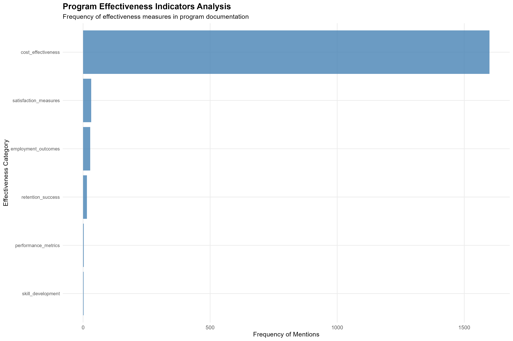

# Autism Employment Program Effectiveness Analysis Report

**Report Generated:**  2025-05-26
**Analysis Timestamp:**  2025-05-26 16:15:11.457599
**Document Analyzed:**  Autism_Employment_Report.txt

## Executive Summary

This analysis focuses specifically on program effectiveness indicators within autism employment initiatives. The assessment examines quantitative outcomes, success metrics, and evidence-based measures of program impact.

## Quantitative Program Metrics

**Rating Scale Measures:**
-  8 out of 10

## Program Effectiveness Indicators

** Employment outcomes :**  28  references
Sample context: "... job counseling, training, benefits counseling and job placement. Sentiment Score: 54 Source: https:/ ..."

** Performance metrics :**  3  references
Sample context: "...  Diversity and Inclusion Driving Innovation and Productivity for Your Business  The Precisionists, I ..."

** Satisfaction measures :**  32  references
Sample context: "... utcomes for college students with autism. Student Well-being: We want autistic students to feel conf ..."

** Cost effectiveness :**  1599  references
Sample context: "... ive Biographies   Organizations   History         Budget and Performance   VA Plans, Budget, & Perfo ..."

** Retention success :**  15  references
Sample context: "... nd information   that facilitate employment and job retention for individuals   with disabilities, i ..."

** Skill development :**  2  references
Sample context: "... ions Services for Individuals Professional Soft Skills Training Coaching for Neurodivergent Individu ..."

## Methodology

This analysis employed targeted extraction of program effectiveness indicators including employment outcomes, performance metrics, satisfaction measures, employer feedback, cost-effectiveness data, retention success, skill development outcomes, and support effectiveness measures. Quantitative metrics were systematically identified and extracted to provide evidence-based assessment of program impact.

## Key Assessment Areas

The analysis concentrated on eight primary effectiveness domains: employment outcomes and job placement success, performance metrics and workplace productivity measures, participant and employer satisfaction indicators, cost-effectiveness and return on investment data, job retention and long-term success rates, skill development and training effectiveness, and support intervention success measures.

## Recommendations for Program Evaluation

Future program assessments should emphasize longitudinal tracking of employment outcomes, standardized measurement of cost-effectiveness ratios, systematic collection of employer feedback, regular assessment of participant satisfaction and well-being indicators, and comprehensive documentation of workplace accommodation effectiveness.

---
*Report generated by Autism Employment Program Effectiveness Analysis System*
